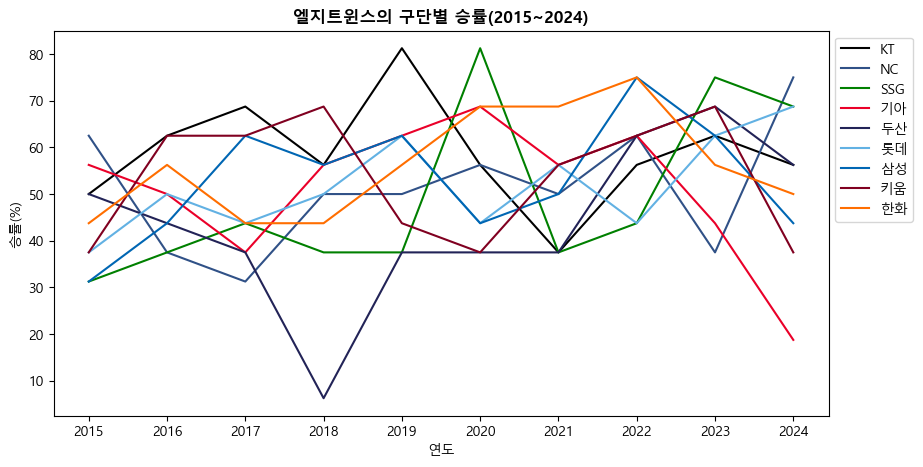

# 2025년 엘지트윈스 경기 승률 예측

## 1. 프로젝트 개요
### (1) 프로젝트 배경
|   항목    |   내용    |
|:---:|---|
|팬 경험 확대|스포츠 관람 문화의 발전에 따라, 단순 관람을 넘어 더 풍부한 경험 추구|
|경기 결과 변수|예측 불가능성으로 인해 투자한 시간과 비용 대비 만족도 저하 가능성|
|데이터 활용|엘지트윈스의 승률 패턴 분석으로 전략적으로 예매|

### (2) 목표
- 엘지트윈스의 경기 승률에 영향을 미치는 요인
- 2025년 엘지트윈스 승률 예측
- 2025년 엘지트윈스의 상대 구단에 따른 구장(홈·원정)별·(주중·주말)별 경기 승률

### (3) 일정
- 2025년 3월 14일(금) ~ 2025년 3월 20일(목)

## 2. 데이터 수집 및 분석
### (1) 데이터 출처 및 수집 방법
- 출처: 스포키 STATIZ 팀 기록실 (엘지트윈스)
- 수집 방법: 웹 스크롤링 기법을 활용하여 2015년부터 2024년까지 엘지트윈스의 기록 데이터를 수집

### (2) 데이터 개요
- **데이터 항목**
    - Year, G, GS, W, L, S, HD, IP, R, ER, RS, RS9, TBF, AB, H, 2B, 3B, HR, BB, IB, HP, SO, SF, NP, WHIP, AVG, OBP, OPS, ERA
- **전처리 계획**
    - 중복 또는 불필요한 컬럼 제거
    - 컬럼 'GS'와 'W' 컬럼을 나눠 'winning_rate'란 새로운 컬럼 생성
- **기본 분석 방법**
    - 경기 승률에 영향을 미치는 요인
    - 상대 구단에 따른 시리즈별 승률
    - 상대 구단에 따른 홈과 원정일 때의 승률

## 3. 기대효과 및 활용방안
### (1) 팬 입장
- **승리 가능성이 높은 경기 관람**
    - 응원하는 팀이 승리하는 순간을 직접 경험할 가능성 높아짐으로써 큰 만족감을 느낌
- **한정된 예산 내에서 최적의 관람 기회 확보**
    - 예매 비용 증가 등 물가 상승 속에서 경기 승률을 고려한 전략적 예매를 통해 가성비 있는 경기를 관람
- **관람 만족도 및 몰입감 향상**
    - 유리한 경기 환경(특정 구장에서의 높은 승률, 특정 시리즈의 강세 등)을 고려하여 예매할 수 있어, 더욱 깊이 있는 응원과 감동을 경험
- **데이터 기반의 스마트한 야구 관람 문화 장착**
    - 감(感) 또는 일정만 고려한 기존의 예매 방식에서 벗어나, 객관적인 데이터를 바탕으로 최적의 일정을 계획하는 문화를 조성

### (2) 구단 입장
- **팬 경험 증대 및 티켓 판매 전략 수립**
    - 특정 시리즈 또는 구장에서의 승률 데이터를 활용해 팬들에게 보다 매력적인 경기 일정을 홍보하는 마케팅 전략을 수립
    - 예를들어, 승률이 높은 시리즈나 상대팀과의 경기를 중심으로 프로모션을 진행하거나 해당 경기의 관중 동원을 적극 유도함으로써 티켓 판매율 상승 기대
- **경기 전략 개선을 위한 데이터 활용**
    - 경기 운영 전략 개선
    - 불리한 환경에서의 전술 변화, 특정 구장에서의 선수 전략 수정 등 다양한 방향으로 경기력 향상을 위한 참고 자료로 활용 가능

## 4. 분석 - 데이터
본격적인 예측에 앞서, 엘지트윈스의 구단별 승률(2015~2024)를 분석해보았다. 눈에 띄는 기록은, 두산을 상대로 2015년부터 하락세를 보이면서 2018년 가장 낮은 승률(6.25%)을 기록했다.하지만 그 이후 꾸준한 상승세를 보이고 있다. 2019년과 2020년에는 각각 KT와 SSG를 상대로 81.25%의 승률을 기록했다. 기아를 상대로는 2022년 부터 승률이 떨어지고 있으며 한화를 상대로는 비교적 높은 승률을 보이고 있다.<br>


## 5. 분석 - 승률 예측
- 컬럼 'W'(승 수) / 컬럼 'GS'(게임 수) * 100을 계산하여 승률 컬럼인 'winning_rate' 생성
- 승률에 영향을 미치는 주요 특성 파악
    - `RandomForestRegressor`를 활용하여 변수 중요도를 분석
    - 독립변수: `df_team.loc[:, 'S':'ERA']`
    - 종속변수: `df_team['winning_rate']`
    - 특성 중요도 상위 15개 확인
    ```python
    importances = rf.feature_importances_
    feature_names = train_input.columns

    #랜덤 포레스트 변수 중요도
    importance_df = pd.DataFrame({'Feature': feature_names, 'Importance': importances})
    importance_df = importance_df.sort_values(by='Importance', ascending=False)

    #상위 15개 선택
    selected_features = importance_df['Feature'].head(15).tolist()
    selected_features   #RS, OPS, ERA, RS9, AVG, R, S, IP, WHIP, ER, HR, SO, H, SF, OBP
    ```
    - 상위 15개 특성을 투수/타자 항목으로 분류
        - 투타조화 고려
        - 각각 상위 5개를 선택해서 승률에 가장 영향을 미치는 요인으로 선정
        |   분류    |   지표    |
        |:---:|---|
        |투수|RS(득점지원), RS9(9이닝당 득점지원), R(득점), HR(홈런), H(안타), SF(희생플라이)|
        |타자|OPS(피OPS), ERA(평균자책점), AVG(피안타율), S(홀드), IP(이닝), WHIP(이닝당 출루 허용률), ER(자책점), SO(삼진), OBP(피출루율)|